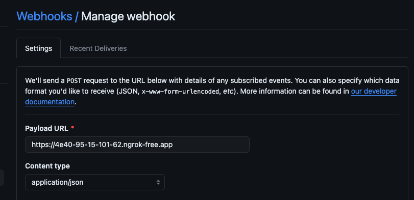

# Tekton CI/CD Pipeline for a Golang Application

This repository showcases a sample Tekton Pipeline designed to perform the following actions:

- Fetch the repository.
- Compile the Go application.
- Run a basic unit test.
- Prepare an image tag.
- Build and push the image to the registry via Kaniko.
- Scan files and images with Trivy.
- Deploy Kubernetes manifests via Helm.

## Prerequisites

- Kubernetes Cluster (Minikube in our case).
- Install Tekton Pipelines ([Installation Guide](https://tekton.dev/docs/installation/pipelines/#installation)).
- Install Tekton Triggers ([Installation Guide](https://tekton.dev/docs/installation/triggers/#installation)).
- Optional: Install Tekton Dashboard ([GitHub](https://github.com/tektoncd/dashboard)).
- Optional: Tekton CLI ([Installation Guide](https://tekton.dev/docs/cli/#installation)).

## Steps

There is an `install.sh` script that helps users to create their first pipeline with one click. If you prefer this method, you will have a running pipeline and finally a running application in your browser. If you wonder what will happen when you run this script, please check `install-script-output.txt`. All you need is a running docker daemon (I used docker-desktop for mac).

If you want your pipeline to be triggered automatically after any push or PR activity, you can continue by jumping to step 6 after running the `install.sh` script, or you can do everything by yourself, starting from the first step.

1. Create and configure a Minikube cluster by applying the following commands:

   ```bash
   brew install minikube  # Edit for your OS if needed
   minikube start
   kubectl create rolebinding admin --clusterrole admin --serviceaccount default:default
   kubectl create namespace go-app
   ```
   Create docker credentials.

   ```bash
   kubectl create secret generic dockerhub-creds --from-file=config.json=/<path-to-your-config.json>
   ```
   Your config.json content should be like below:

   ```bash
      {
      "auths": {
        "https://index.docker.io/v1/": {
          "auth": "SCSDFAFGEASCX", #base64 encoded version of your docker_username:password
          "email": "your-email@example.com"
        }
      }
    }
   ```  

    *You will need an admin privilege to apply pipeline resources.*

    *You will need to have dockerhub-creds secret if your docker registry is private.*

2. Apply tekton pipeline resources.
   
    ```
    kubectl apply --filename https://storage.googleapis.com/tekton-releases/pipeline/latest/release.yaml
    ```

3. Apply Required Tasks from TektonHub
  
   The Tekton hub is a web based platform for developers to discover, share and contribute tasks and pipelines for Tekton. For mor information you can visit [https://github.com/tektoncd/hub]

   *Before running the commands below, be sure that all pods in the tekton-pipelines are ready.*

    ```bash    
      kubectl apply -f https://raw.githubusercontent.com/tektoncd/catalog/main/task/git-clone/0.4/git-clone.yaml

      kubectl apply -f https://raw.githubusercontent.com/tektoncd/catalog/main/task/trivy-scanner/0.2/trivy-scanner.yaml

      kubectl apply -f https://raw.githubusercontent.com/tektoncd/catalog/main/task/kaniko/0.4/kaniko.yaml

      kubectl apply -f https://raw.githubusercontent.com/tektoncd/catalog/main/task/golang-build/0.3/golang-build.yaml

      kubectl apply -f https://raw.githubusercontent.com/tektoncd/catalog/main/task/golang-test/0.2/golang-test.yaml
    ```  

    You can apply them via tekton cli as well.

    ```bash 
      tkn hub install task git-clone

      tkn hub install task golang-build

      tkn hub install task golang-test

      tkn hub install task kaniko

      tkn hub install task trivy-scanner
    ```  
  
4. Create role and rolebinding for helm deployment process

    ```
    kubectl apply -f - <<EOF
    apiVersion: rbac.authorization.k8s.io/v1
    kind: Role
    metadata:
      namespace: go-app
      name: helm-deploy-role
    rules:
    - apiGroups: [""]
      resources: ["secrets", "services", "pods", "deployments", "configmaps", "services/finalizers"]
      verbs: ["get", "list", "create", "update", "delete", "patch"]
    - apiGroups: ["apps"]
      resources: ["deployments", replicasets]
      verbs: ["get", "list", "create", "update", "delete", "patch"]
    ---
    apiVersion: rbac.authorization.k8s.io/v1
    kind: RoleBinding
    metadata:
      name: helm-deploy-role-binding
      namespace: go-app
    subjects:
    - kind: ServiceAccount
      name: default
      namespace: default
    roleRef:
      kind: Role
      name: helm-deploy-role
      apiGroup: rbac.authorization.k8s.io
    EOF
    ```

    *You will need this privilege for helm deployment.*

5. Clone this repository and apply the required Files
  
    ```bash
    git clone https://github.com/fsubasi/tekton-cicd.git

    cd tekton-cicd/tekton

    kubectl apply -f ./helm-upgrade.yaml

    kubectl apply -f ./pipeline.yaml

    kubectl apply -f ./trigger-binding.yaml
  
    kubectl apply -f ./trigger-template.yaml

    kubectl apply -f ./event-listener.yaml

    kubectl apply -f ./rbac-for-trigger/rbac.yaml

    kubectl create -f ./pipelinerun.yaml
    ```

    *In order to trigger the pipeline manually, you need to run `kubectl create` command instead of `kubectl apply` because you cannot use generate name with apply.*

6. Follow the instructions [here](https://dev.to/leandronsp/tekton-ci-part-iii-listen-to-github-events-1h3i) to setup pipeline trigger, ngrok and github webhook.

   After completing this steps, your pipeline will be triggered automatically in any PR or push actions.

   *You will need to sign up the ngrok to complete those steps.*

7. Congrats if your pipeline has been completed with these logs.

    ```bash
    [deploy : helm-upgrade] Release "go-app" has been upgraded. Happy Helming!
    [deploy : helm-upgrade] NAME: go-app
    [deploy : helm-upgrade] LAST DEPLOYED: Tue Apr  9 22:44:43 2024
    [deploy : helm-upgrade] NAMESPACE: go-app
    [deploy : helm-upgrade] STATUS: deployed
    [deploy : helm-upgrade] REVISION: 2
    [deploy : helm-upgrade] TEST SUITE: None
    ```
8. Check if your application pod is running in the specified namespace.
  
    ```bash
    kubectl get pods -n go-app
    NAME                             READY   STATUS    RESTARTS   AGE
    go-deployment-7db9d9545d-8vn4w   1/1     Running   0          33s
    ```
9. Check if your NodePort service has been deployed properly.

    ```bash
      kubectl get service -n go-app
      NAME   TYPE       CLUSTER-IP       EXTERNAL-IP   PORT(S)          AGE
      go     NodePort   10.104.106.133   <none>        8080:31541/TCP   49m  
    ```
10. You can reach the application from browser by running the `minikube service go --namespace go-app` . This will redirect you to the browser by printing this lines.

    |-----------|------|-------------|---------------------------|
    | NAMESPACE | NAME | TARGET PORT |            URL            |
    |-----------|------|-------------|---------------------------|
    | go-app    | go   |        8080 | http://192.168.49.2:31541 |
    |-----------|------|-------------|---------------------------|
    🏃  Starting tunnel for service go.
    |-----------|------|-------------|------------------------|
    | NAMESPACE | NAME | TARGET PORT |          URL           |
    |-----------|------|-------------|------------------------|
    | go-app    | go   |             | http://127.0.0.1:49240 |
    |-----------|------|-------------|------------------------|
    🎉  Opening service go-app/go in default browser...
    ❗  Because you are using a Docker driver on darwin, the terminal needs to be open to run it.


  Here we go!


  

## Notes

1. Command to delete successfully completed pods.

    `kubectl delete pods --field-selector=status.phase==Succeeded --namespace=your_namespace`

2. Command to delete failed pods.

    `kubectl delete pods --field-selector=status.phase==Failed --namespace=your_namespace`

3. Command to follow pipeline run status

    `tkn pipelinerun logs --follow --last`

4. Sometimes, ngrok dns might be changed if you use the free version. At this time, you need to update the payload url of the github webhook with the new dns here.
   

    


    

